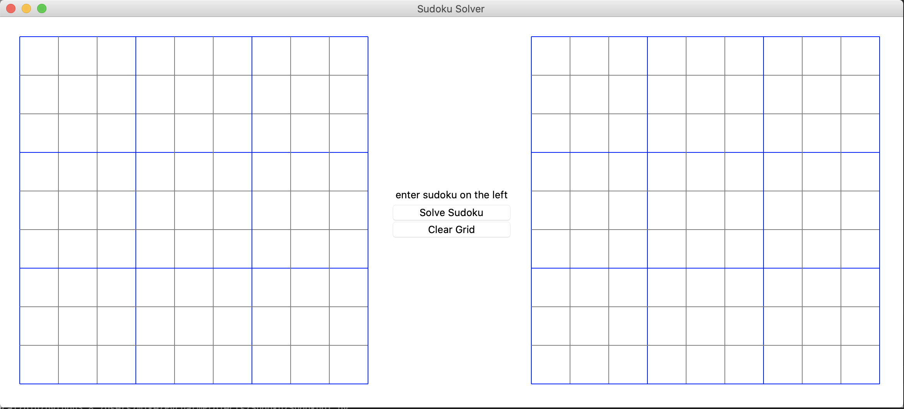
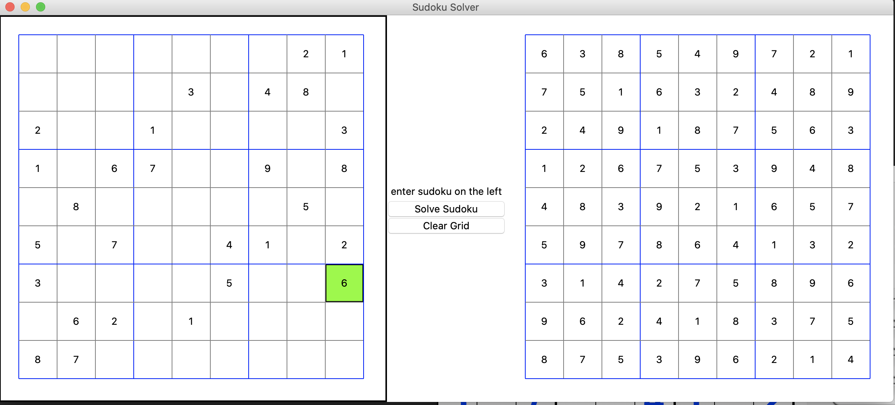
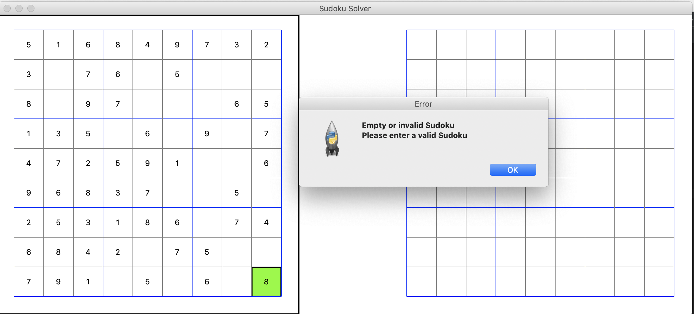

# Sudoku Solver

This is a Sudoku solver with a simple GUI built by python

To use the solver, run the SudokuUI.py file, and you will see a window open up on your desktop like 
the following:  

Then, you can enter the Sudoku problem on the left. After entering the problem, click the Solve Sudoku button 
in the middle and you will see the solved result on the right.  

If the Sudoku is unsolvable, you will see a popup telling you that the Sudoku is unsolvable, as the following picture shows:  

To clear the grid, click the clear grid button in the middle.
